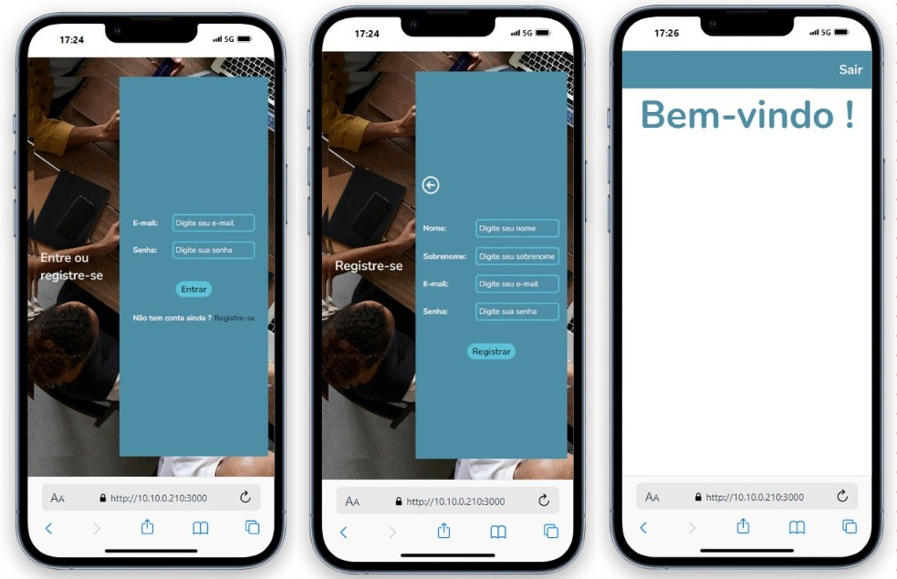

# TELA DE LOGIN COM AUTENTICAÇÃO - LARAVEL E REACT

## - Descrição do Projeto
  
Este projeto foi desenvolvido com a finalidade de aprendizado e visa integrar uma aplicação front-end em React com uma API back-end desenvolvida em Laravel. O objetivo é criar uma plataforma funcional que pode ser usada como base para futuros aprimoramentos e implementação de novas funcionalidades.

## - Tecnologias Utilizadas
  
React: Biblioteca JavaScript para construção de interfaces de usuário.

Laravel: Framework PHP para desenvolvimento de aplicações web robustas e escaláveis.

Axios: Biblioteca para fazer requisições HTTP a partir do front-end.

React Router: Biblioteca para gerenciamento de rotas no React.

CSS: Para estilização dos componentes da aplicação.

## -Funcionalidades Principais

Autenticação de Usuário: Implementação de login e logout com armazenamento de token JWT no localStorage.

Registro de Usuário: Formulário para novos usuários se registrarem na plataforma.

Proteção de Rotas: Garantia de que apenas usuários autenticados possam acessar certas páginas da aplicação.

# ALGUMAS IMAGENS DO PROJETO

